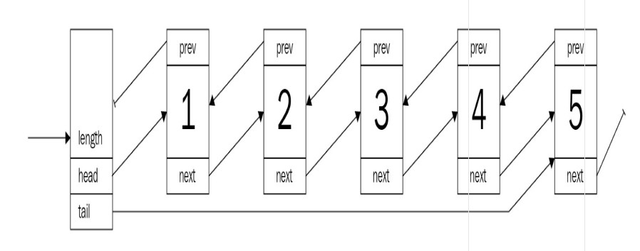

>* 原文链接：https://www.packtpub.com/product/hands-on-data-structures-and-algorithms-with-rust/9781788995528
>* 译文来自：https://github.com/suhanyujie/learn-computer

# 列表，列表还是列表
列表无处不在：购物清单，待办事项清单，食谱，街道号码……无处不在。它们的定义特征，将事物存储在线性、确定的关系实体中，帮助我们跟踪事物信息并在后续需要时再找它。从数据结构的角度来看，它们对几乎任何程序都是必不可少的，并且有各种不同的载体和形式。虽然列表在 Rust 中很难实现，但一般的原则也可以在这里找到，以及一些关于借用检查器的经验！阅读本章之后，我们希望你对以下内容有进一步的了解：

* （双向）链表以及你什么时候使用它
* 数组列表，更广为人所知的是 Rust 中的 vector
* 跳跃表，有点类似是纽约地铁系统
* 实现一个简单的事务日志

>最后，本章将构建各种列表的 safe 实现，尽管 unsafe 的版本可能会更快，或更少的代码。这一决定是由于，在处理常规用例时，unsafe 从来都不是一个解决方案。详细内容可以查看本章关于unsafe 列表的链接。

## 链表
为了跟踪一堆 item，有一个简单的解决方案：对于列表中的每个 item，存储一个指向下一个 item 的指针。如果没有下一项，则存储 null/nil/none 等，并保存指向第一项的指针。这被称为单链表，其中每个项都带有一个指针指向下一项，如下图所示：


但是，链表的真正使用场景是什么？难道不是作为动态数组吗？

想想“事务日志”，它是一个典型的只会写入的结构。任何新的命令（如 SQL 语句）都会很容易地附加到现有的链表中，并最终写入到持久性存储介质中。因此，初步要求很简单：
* 向已存在的列表中插入新的项
* 重新从头到尾有序地遍历每一项

换句话说，这是一个队列（或 LIFO —— 即后进先出（List In First Out））结构。

### 事务日志
首先，定义一个列表，在 Rust 中，缺少 null 类型，每个项都由一个 Option 属性指向下一项。Option 枚举也可以包装值，在这种情况下值是堆引用（例如 Box、Rc 等）或 none —— Rust类型中 null 的等价物。为什么？让我们了解一下！

创建一个原型实现来进行探索会更好一些，特别是因为编译器经常提供直观的反馈信息。因此，第一步先实现整数列表。对于列表元素，下面这个结构体怎么样？

请看代码片段：

```rust
struct Node {
    value: i32,
    next: Option<Node>
}
```

考虑到现状，它需要一种方法来确定从哪里开始以及列表的长度。想想前面提到 append 操作，以及对尾部（tail）的引用，看看下面代码：

```rust
struct TransactionLog {
    head: Option<Node>,
    tail: Option<Node>,
    pub length: u64,
}
```

看起来符合我们的需要！看看它是否能编译？

```
error[E0072]: recursive type `Node` has infinite size
 --> src\lib.rs:1:1
  |
1 | struct Node {
  | ^^^^^^^^^^^ recursive type has infinite size
2 |     value: i32,
3 |     next: Option<Node>
  |           ------------ recursive without indirection
  |
help: insert some indirection (e.g., a `Box`, `Rc`, or `&`) to make `Node` representable
  |
3 |     next: Box<Option<Node>>
  |           ^^^^            ^

error: aborting due to previous error
```

不幸的是，它无法通过编译 —— 而且，回顾前几章，原因很清楚：编译器不能确定数据结构的大小，因为整个列表必须嵌套到第一个元素中。然而，正如我们所知，编译器无法以这种方式计算并分配所需的内存量 —— 这就是为什么需要引用类型。引用类型(如 Box、Rc 等)在这里是很适合的，因为它们在堆上分配空间，因此允许更大的列表。以下是修改后的版本：

```rust
struct Node {
    value: i32,
    next: Option<Rc<RefCell<Node>>>
}

struct TransactionLog {
    head: Option<Rc<RefCell<Node>>>,
    tail: Option<Rc<RefCell<Node>>>,
    pub length: u64,
}
```

将每个节点存储在 `Rc<RefCell<T>>` 中，这样能根据需要提供检索和替换数据的能力（内部可变模式）—— 这是至关重要的链表操作。另一个好的实践是定义类型别名，特别是如果类型中有很多泛型的时候。这使得替换类型实现很容易，而却可读性更好：

```rust
type SingleLink = Option<Rc<RefCell<Node>>>;

struct Node {
    value: i32,
    next: SingleLink
}

struct TransactionLog {
    head: SingleLink,
    tail: SingleLink,
    pub length: u64,
}
```

完美！这是事务日志的基本定义，但它还缺少很多东西。首先，值类型必须是字符串：

```rust
type SingleLink = Option<Rc<RefCell<Node>>>;

struct Node {
    value: String,
    next: SingleLink
}

struct TransactionLog {
    head: SingleLink,
    tail: SingleLink,
    pub length: u64,
}

impl Node {
    fn new(value: String) -> Rc<RefCell<Node>> {
        Rc::new(RefCell::new(Node{
            value,
            next: None,
        }))
    }
}
```

此外，创建一个空列表将会很有用，所以 TransactionLog 的 impl 代码块需要一个函数 —— new_empty()：

```rust
impl TransactionLog {
    pub fn new_empty() -> Self {
        TransactionLog {
            head: None,
            tail: None,
            length: 0,
        }
    }
}
```

不过，还是有很多缺失的地方。综上所述，事务日志有两个要求：

* 可以在尾部进行 append 操作
* 可以从头部进行 remove 操作

让我们从第一个需求开始：在列表的后面追加元素！

### 增加入口
现在可以创建事务日志并将其保存在一个变量中，但是现在还没有办法向列表中添加任何内容。通常，列表能够向任何一端添加元素，只要拿到那一端的指针。如果不是这样，操作会有很大的开销，因为需要遍历所有节点才能找到它的后继节点。如果有一个指针指向列表的末尾（tail），append 操作就不同了；但是，如果访问列表上的随机索引，将需要一些时间来完成所有内容。

>命名通常很棘手，尤其是对于英语是第二语言的人。操作根据所使用的语言或库而有不同的名称。例如，用于添加项目到列表的常用名称包括 push（可以添加到前面或后面）、push_back、add、insert（通常带有位置参数）或 append。除了能够猜测方法名之外，有些进程还意味着与其他进程完全不同的进程！如果您设计了一个接口或库，请找到最具描述性和最简单的名称，并尽可能地复用！

这是链表做非常好的事情之一 —— 向两端添加项。不过，有一些关键的事情不应忽视：

* 通过方法创建 Node 对象以获得更好的 API 和更好的所有权处理。
* 边缘的情况，如空列表。
* 增加长度是个好点子。
*　RefCell 用于检索可变的所有权变量，用于使用其 `borrow_mut()` 函数（内部可变性）设置新的节点。

一旦想到了这一点，实现起来就不算太糟糕。Rust 的 Option 类型提供了一种检索其值是否有所有权的方法，将其替换为 None (请参见 `Option.take()` —— https://doc.rust-lang.org/std/option/enum.Option.html#method.take 和 `mem：：replace()` — https://doc.rust-lang.org/stable/std/mem/fn.replace.html)，它方便地简化了新增节点的代码：

```rust
pub fn append(&mut self, value: String) {
    let new = Node::new(value);

    match self.tail.take() {
        Some(old) => {
            (*old).borrow_mut().next = Some(new.clone())
        },
        None => self.head = Some(new.clone())
    };
    self.length += 1;
    self.tail = Some(new);
}
```

这样，现在就可以通过传入任意字符串命令创建日志了。然而，这里也缺少了一些重要的东西：日志查看。

### 日志查看
通常在数据库中，如果必须恢复数据库，或者保持副本的最新状态，事务日志是一种弹性地辅助工具。原理相当简单：日志描述时间轴上按照确定的顺序执行的命令。因此，可以重新恢复数据库之前最终状态，就需要从最旧的日志行开始，并按照该顺序执行所有日志事务。

你可能已经大概知道“日志查看”为何用链表做更合适。那么，当前的实现还欠缺什么呢？

从头部开始移除元素的能力。

由于整个数据结构类似于一个队列，所以这个函数暂且称为 pop，因为它是这类操作比较合适的名称。此外，pop 将取出项并返回，使列表成为一个一次性的结构。这是有意义的，以避免重复操作元素！

这看起来比现在要复杂得多：目前内部可变性的模式增加了实现的复杂性。然而，它让链表更加安全 —— 多亏了 RefCell 在运行时的借用检查规则。这也导致最后一部分的函数链 — 它从其包装器中检索值：

```rust
pub fn pop(&mut self) -> Option<String>{
    self.head.take().map(|head| {
        if let Some(next) = (*head).borrow_mut().next.take() {
            self.head = Some(next);
        } else {
            self.tail.take();
        }
        self.length -= 1;
        Rc::try_unwrap(head).ok().expect("Something is terribly wrong").into_inner().value
    })
}
```

按顺序调用这个函数返回的命令就是按顺序插入的结果，提供了一个很好的“回放”特性。在真实场景的使用中，提供将此状态序列化到磁盘的能力也很重要，特别是因为此操作会消耗整个列表的元素。此外，建议您优雅地处理错误（而不是制造恐慌和崩溃）。

### 使用之后
每当需要处理列表时，Rust 就会自动调用 drop() 方法。但是，由于这是一个自动化的过程，每个元素都会被递归地删除 —— 它可以正常工作，直到嵌套的下一个指针的层数超过执行 drop() 方法的堆栈的最大层数，此时会抛出未知的堆栈溢出消息使程序崩溃。

因此，对于生产环境来说，实现递归下降特性并迭代处理列表元素会是更好的选择。顺便说一下，出于同样的原因，在使用派生的 Debug trait 实现打印 Node 时也会发生栈溢出。

### 更好的方案
（事务）日志是使用链表的很好的场景：它们通常会增长到意想不到的大小，并且不需要进行索引。虽然链表在其他语言中通常是非常简单的类型，但它在 Rust 中是一个很大的挑战。这主要是由于借用和所有权特性导致，这需要程序员详细地考虑一些实现细节。然而，对于实际的场景，最好使用 Rust 标准库中的链表（std::collections::LinkedList）。从性能的角度来看，在单链表中找到一个指定的项在最坏的情况下需要查看整个列表，从而导致运行时复杂性为 `O(n)`，`n` 是列表中的项目数量。

### 优点
链表的主要好处是能够低成本地增长地非常大，始终保持一定的方向，并可以单独访问每个元素。这种数据结构有什么独特性？这里有以下几点：

* 每个元素的低开销分配。
* 元素数量仅受堆内存的限制。
* 在迭代时是可变的（可以修改）。
* 链表的方向是严格固定的，没有拐弯。
* 实现过程简单（即使是在Rust中）。
* 与数组相比（无需移动）具有高效的追加、前插、删除和插入操作

通常，链表在有限内存、没有太多分配的资源的环境中（如动态阵列）或作为外来的无锁数据结构的基础具有良好的性能。

### 缺点
该链表有一些明显的缺点：

* 索引效率很低，因为我们都必须遍历所有节点。
* 一般来说，在堆上迭代会有大量跳转，这需要更多的时间开销，并使操作数据难以缓存。
* 反转列表非常低效。

最后一点很重要，所以，通常，链表实现也会有一个额外的指针链接，这使它可以作为双链表。

## 双链表
上一节的事务日志可以进行升级。产品希望让用户能够向前和向后查看日志，便于查看每个步骤日志的具体内容。这是常规链表做不到的，因为它除了前进之外，其他任何操作都很低效。那么，这是如何改善呢？

可以使用双链表进行优化。双链表引入向后链接的引用。虽然这听起来像是一个小变化，但它允许向后和向前查看链表，这显著提高了查找的能力。通过使用反向指针扩充以前的单链表的项，双链表结构如下：

```

```

与单链表类似，链表本身只包含一个头指针和一个尾指针，这使得访问链表的内容更加容易。此外，这些节点现在还具有一个指向前一个节点的指针，使链表看起来是这样的：



这也是 Rust 中双链表棘手的一点。如果有所有权层次结构，所有权原则很好：用户地址、文本文件有几行等等。但是，双链表中的节点对其两个邻居节点都没有明确的所有权。

### 优化事务日志
因此，需要做如下扩展：
* 通过日志向前移动
* 通过日志向后移动
* 移动不会消耗日志

使用双链表非常适合，因此现在可以对事务日志进行升级！有了指向两个邻居节点的指针，就可以解决问题。但是，如果在不移除元素的情况下查看链表呢？

为此，还需要另一个概念：迭代器。Rust 的迭代器基于编程语言的的函数特性，并提供了一个通用的接口，来集成各种其他数据结构和跨语言的命令行。例如，对于 `for` 循环，将在迭代器上拾取并按照预期的行为。

> 迭代器是指向当前项的指针，它有一个方法名为 `next()`，该方法在向前移动指针的同时生成下一个项！当需要一种实用的方法来处理集合时，这个概念经常被使用：通过将它们链接在一起并调用 `next()` 函数，浏览一个列表是非常高效的。

这个数据模型将看起来像单链表，所以大多数操作都可以正常调用 —— 只需要升级后使用指向反向的指针。

### 检查日志
查看链表而不消耗它可以用迭代器实现（见信息框），在 Rust 和其他语言中，它是一个接口或 trait 的简单实现。事实上，这很常见，以至于 Rust 有一篇很棒的[相关文档](https://doc.rust-lang.org/std/iter/index.html#implementing-iterator)，这正是需要学习的。

由于我们已经在处理堆引用，迭代器可以简单地保存一个节点的 option 引用，并且很容易向前或向后移动它：

```rust
pub struct ListIterator {
    current: Link,
}

impl ListIterator {
    fn new(start_at: Link) -> Self {
        ListIterator {
            current: start_at,
        }
    }
}
```

如文档所述，`for` 循环使用了两个 trait：`Iterrator` 和 `IntoIterator`。一般会实现前者，因为它提供了对迭代器中强大的方法来访问元素，如 `map`、`fold` 等，并与其他兼容的迭代器很好地结合在一起：

```rust
impl Iterator for ListIterator {
    type Item = String;

    fn next(&mut self) -> Option<Self::Item> {
        let current = &self.current;
        let mut result = None;
        self.current = match current {
            Some(ref current) => {
                let current = current.borrow();
                result = Some(current.value.clone());
                current.next.clone()
            },
            None => None
        };
        result
    }
}
```

这个迭代器负责向一个方向移动：前进。那么我们也能知道怎么走回去吧？

### 反转
现在，由于我们的需求是往回走，迭代器需要双向进行。有一种简单的方法是在结构中添加一个被称为 `reverse()` 的函数，但这将不能很好地集成，并且需要开发人员理解这个 API，并且它将带来额外的开销，因为正向/反向迭代器是独立的。


