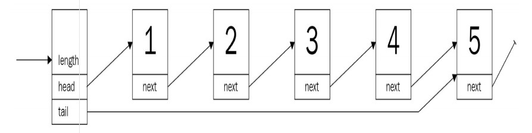

# 列表，列表还是列表
列表无处不在：购物清单，待办事项清单，食谱，街道号码……无处不在。它们的定义特征，将事物存储在线性、确定的关系实体中，帮助我们跟踪事物信息并在后续需要时再找它。从数据结构的角度来看，它们对几乎任何程序都是必不可少的，并且有各种不同的载体和形式。虽然列表在 Rust 中很难实现，但一般的原则也可以在这里找到，以及一些关于借用检查器的经验！阅读本章之后，我们希望你对以下内容有进一步的了解：

* （双向）链表以及你什么时候使用它
* 数组列表，更广为人所知的是 Rust 中的 vector
* 跳跃表，有点类似是纽约地铁系统
* 实现一个简单的事务日志

>最后，本章将构建各种列表的 safe 实现，尽管 unsafe 的版本可能会更快，或更少的代码。这一决定是由于，在处理常规用例时，unsafe 从来都不是一个解决方案。详细内容可以查看本章关于unsafe 列表的链接。

## 链表
为了跟踪一堆 item，有一个简单的解决方案：对于列表中的每个 item，存储一个指向下一个 item 的指针。如果没有下一项，则存储 null/nil/none 等，并保存指向第一项的指针。这被称为单链表，其中每个项都带有一个指针指向下一项，如下图所示：



但是，链接列表的真正使用场景是什么？难道不是作为动态数组吗？

想想“事务日志”，它是一个典型的只会写入的结构。任何新的命令（如 SQL 语句）都会很容易地附加到现有的链表中，并最终写入到持久性存储介质中。因此，初步要求很简单：
* 向已存在的列表中插入新的项
* 重新从头到尾有序地遍历每一项

换句话说，这是一个队列（或 LIFO —— 即后进先出（List In First Out））结构。

### 事务日志
首先，定义一个列表，在 Rust 中，缺少 null 类型，每个项都由一个 Option 属性指向下一项。Option 枚举也可以包装值，在这种情况下值是堆引用（例如 Box、Rc 等）或 none —— Rust类型中 null 的等价物。为什么？让我们了解一下！

创建一个原型实现来进行探索会更好一些，特别是因为编译器经常提供直观的反馈信息。因此，第一步先实现整数列表。对于列表元素，下面这个结构体怎么样？

请看代码片段：

```rust
struct Node {
    value: i32,
    next: Option<Node>
}
```

考虑到现状，它需要一种方法来确定从哪里开始以及列表的长度。想想前面提到 append 操作，以及对尾部（tail）的引用，看看下面代码：

```rust
struct TransactionLog {
    head: Option<Node>,
    tail: Option<Node>,
    pub length: u64,
}
```

看起来符合我们的需要！看看它是否能编译？

```
error[E0072]: recursive type `Node` has infinite size
 --> src\lib.rs:1:1
  |
1 | struct Node {
  | ^^^^^^^^^^^ recursive type has infinite size
2 |     value: i32,
3 |     next: Option<Node>
  |           ------------ recursive without indirection
  |
help: insert some indirection (e.g., a `Box`, `Rc`, or `&`) to make `Node` representable
  |
3 |     next: Box<Option<Node>>
  |           ^^^^            ^

error: aborting due to previous error
```

不幸的是，它无法通过编译 —— 而且，回顾前几章，原因很清楚：编译器不能确定数据结构的大小，因为整个列表必须嵌套到第一个元素中。然而，正如我们所知，编译器无法以这种方式计算并分配所需的内存量 —— 这就是为什么需要引用类型。引用类型(如 Box、Rc 等)在这里是很适合的，因为它们在堆上分配空间，因此允许更大的列表。以下是修改后的版本：

```rust
struct Node {
    value: i32,
    next: Option<Rc<RefCell<Node>>>
}

struct TransactionLog {
    head: Option<Rc<RefCell<Node>>>,
    tail: Option<Rc<RefCell<Node>>>,
    pub length: u64,
}
```

将每个节点存储在 `Rc<RefCell<T>>` 中，这样能根据需要提供检索和替换数据的能力（内部可变模式）—— 这是至关重要的链表操作。另一个好的实践是定义类型别名，特别是如果类型中有很多泛型的时候。这使得替换类型实现很容易，而却可读性更好：

```rust
type SingleLink = Option<Rc<RefCell<Node>>>;

struct Node {
    value: i32,
    next: SingleLink
}

struct TransactionLog {
    head: SingleLink,
    tail: SingleLink,
    pub length: u64,
}
```

完美！这是事务日志的基本定义，但它还缺少很多东西。首先，值类型必须是字符串：

```rust
type SingleLink = Option<Rc<RefCell<Node>>>;

struct Node {
    value: String,
    next: SingleLink
}

struct TransactionLog {
    head: SingleLink,
    tail: SingleLink,
    pub length: u64,
}

impl Node {
    fn new(value: String) -> Rc<RefCell<Node>> {
        Rc::new(RefCell::new(Node{
            value,
            next: None,
        }))
    }
}
```

此外，创建一个空列表将会很有用，所以 TransactionLog 的 impl 代码块需要一个函数 —— new_empty()：

```rust
impl TransactionLog {
    pub fn new_empty() -> Self {
        TransactionLog {
            head: None,
            tail: None,
            length: 0,
        }
    }
}
```

不过，还是有很多缺失的地方。综上所述，事务日志有两个要求：

* 可以在尾部进行 append 操作
* 可以从头部进行 remove 操作

让我们从第一个需求开始：在列表的后面追加元素！

### 增加入口
现在可以创建事务日志并将其保存在一个变量中，但是现在还没有办法向列表中添加任何内容。通常，列表能够向任何一端添加元素，只要有指向该端的指针。如果不是这样，任何操作都会有很大成本，因为需要遍历所有项才能找到它的后继节点。如果指针指向列表的末尾（tail），append 操作就不是这种情况；但是，如果访问列表上的随机索引，将需要一些时间来完成所有内容。


