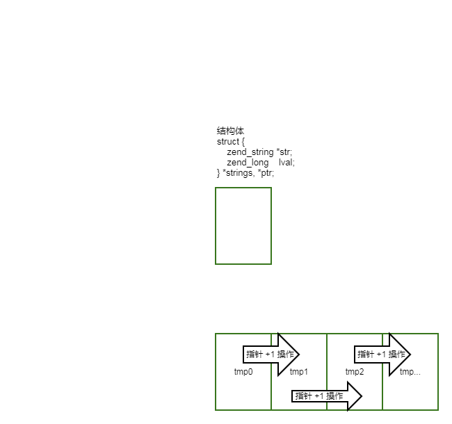

# implode 函数源码分析
>*本文[首发](https://github.com/suhanyujie/learn-computer/blob/master/src/function/string/implode.md)于 https://github.com/suhanyujie/learn-computer/blob/master/src/function/string/implode.md* <br>
基于PHP 7.3.3

## PHP 中的 implode
* 在 PHP 中，implode 的作用是：将一个一维数组的值转化为字符串。记住一维数组，如果是多维的，会发生什么呢？在本篇分析中，会有所探讨。
* 事实上，通过官方的文档可以知道，implode 有两种用法，通过函数签名可以看得出来：

```php
// 方法1
implode ( string $glue , array $pieces ) : string
// 方法2
implode ( array $pieces ) : string
```

* 因为，在不传 glue 的时候，内部实现会默认空字符串。
* 通过一个简单的示例可以看出：

```php
$pieces = [
    123,
    ',是一个',
    'number!',
];
$str1 = implode($pieces);
$str2 = implode('', $pieces);

var_dump($str1, $str2);
/*
string(20) "123,是一个number!"
string(20) "123,是一个number!"
*/
```

## implode 源码实现
* 通过搜索关键字 `PHP_FUNCTION(explode)` 可以找到，该函数定义于 `\ext\standard\string.c` 文件中的 [1288 行](https://github.com/php/php-src/blob/9ebd7f36b1bcbb2b425ab8e903846f3339d6d566/ext/standard/string.c#L1288)
* 一开始的几行是参数声明相关的信息。其中 *arg2 是用于接收 pieces 参数的指针。
* 在下方对 arg2 的判断中，如果 arg2 为空，则表示没有传 pieces 对应的值

```c
if (arg2 == NULL) {
    if (Z_TYPE_P(arg1) != IS_ARRAY) {
        php_error_docref(NULL, E_WARNING, "Argument must be an array");
        return;
    }

    glue = ZSTR_EMPTY_ALLOC();
    tmp_glue = NULL;
    pieces = arg1;
} else {
    if (Z_TYPE_P(arg1) == IS_ARRAY) {
        glue = zval_get_tmp_string(arg2, &tmp_glue);
        pieces = arg1;
    } else if (Z_TYPE_P(arg2) == IS_ARRAY) {
        glue = zval_get_tmp_string(arg1, &tmp_glue);
        pieces = arg2;
    } else {
        php_error_docref(NULL, E_WARNING, "Invalid arguments passed");
        return;
    }
}
```

### 不传递 pieces 参数
* 在不传递 pieces 参数的判断中，即 `arg2 == NULL`，主要是对参数的一些处理
* 将 glue 初始化为空字符串，并将传进来的唯一的参数，赋值给 pieces 变量，接着就调用 `php_implode(glue, pieces, return_value);`

### 十分关键的 php_implode
* 无论有没有传递 pieces 参数，在处理好参数后，最终都会调用 PHPAPI 的相关函数 php_implode，可见，关键逻辑都是在这个函数中实现的，那么我们深入其中看一看它
* 在调用 php_implode 时，出现了一个看起来没有被声明的变量 return_value。没错，它似乎就是凭空出现的
* 通过谷歌搜索 `PHP源码中 return_value`，找到了[答案](http://demon.tw/programming/php-function-return_value.html)。
* 原来，这个变量是伴随着宏 PHP_FUNCTION 而出现的，而此处 implode 的实现就是通过 `PHP_FUNCTION(implode)` 来声明的。而 PHP_FUNCTION 的定义是:

```c
#define PHP_FUNCTION			ZEND_FUNCTION
// 对应的 ZEND_FUNCTION 定义如下
#define ZEND_FUNCTION(name)				ZEND_NAMED_FUNCTION(ZEND_FN(name))
// 对应的 ZEND_NAMED_FUNCTION 定义如下
#define ZEND_NAMED_FUNCTION(name)		void ZEND_FASTCALL name(INTERNAL_FUNCTION_PARAMETERS)
// 对应的 ZEND_FN 定义如下
#define ZEND_FN(name) zif_##name
// 对应的 ZEND_FASTCALL 定义如下
# define ZEND_FASTCALL __attribute__((fastcall))
```

* （关于双井号，它起连接符的作用，可以[参考这里](http://www.php-internals.com/book/?p=chapt01/01-03-comm-code-in-php-src)了解）
* 在被预处理后，它的样子类似于下方所示：

```c
void zif_implode(int ht, zval *return_value, zval **return_value_ptr, zval *this_ptr, int return_value_used TSRMLS_DC)
```

* 也就是说 return_value 是作为整个 implode 扩展函数定义的一个形参
* 在 php_implode 的定义中，一开始，先定义了一些即将用到的变量，随后使用 `ALLOCA_FLAG(use_heap)` 进行标识，如果申请内存，则申请的是堆内存
* 通过 `numelems = zend_hash_num_elements(Z_ARRVAL_P(pieces));` 获取 pieces 参数的单元数量，如果是空数组，则直接返回空字符串
* 此处还有判断，如果数组单元数为 1，则直接将唯一的单元作为字符串返回。
* 最后是处理多数组单元的情况，因为前面标识过，若申请内存则申请的是堆内存，堆内存相对于栈来讲，效率比较低，所以只在非用不可的情形下，才会申请堆内存，那此处的情形就是多单元数组的情况。
* 随后，针对 pieces 循环，获取其值进行拼接，在源码中的 foreach 循环是固定结构，如下：

```c
ZEND_HASH_FOREACH_VAL(Z_ARRVAL_P(zend_array), tmp) {
    // ...
} ZEND_HASH_FOREACH_END();
```

* 这种常用写法我觉得，在编写 PHP 扩展中是必不可少的吧。虽然我还没有编写过任何一个可用于生产环境的 PHP 扩展。但我正努力朝那个方向走呢！
* 在循环内，对数组单元分为三类：
    * 字符串
    * 整形数据
    * 其它
* 事实上，在循环开始之前，源码中，先申请了一块内存，用于存放下面的结构体，并且个数恰好是 pieces 数组单元的个数。

```c
struct {
    zend_string *str;
    zend_long    lval;
} *strings, *ptr;
```

* 可以看到，结构体成员包含 zend 字符串以及 zend 整形数据。这个结构体的出现，恰好是为了存放数组单元中的 zend 字符串/zend 整形数据。

#### 字符串
* 先假设，pieces 数组单元中，都是字符串类型，此时循环中执行的逻辑就是：

```c
// tmp 是循环中的单元值
ptr->str = Z_STR_P(tmp);
len += ZSTR_LEN(ptr->str);
ptr->lval = 0;
ptr++;
```

* 其中，tmp 是循环中的单元值。每经历一次循环，会将单元值放入结构体中，随后进行指针 +1 运算，指针就指向下一个结构体地址：
* 
* 并且，在这期间，统计出了字符串的总长度 `len += ZSTR_LEN(ptr->str);`
* 循环结束后，ptr 就是指向这段内存的尾部的指针。
* 然后，申请了一段内存：`str = zend_string_safe_alloc(numelems - 1, ZSTR_LEN(glue), len, 0);`，用于存放单元字符串总长度加上连接字符的总长度，即 `(n-1)glue + len`。因为 n 个数组单元，只需要 n-1 个 glue 字符串。然后，将这段内存的尾地址，赋值给 cptr，为什么要指向尾部呢？看下一部分，你就会明白了。
* 接下来，需要循环取出存放在 ptr 中的字符。我们知道，ptr 此时是所处内存区域的尾部，为了能有序展示连接的字符串，源码中，是从后向前循环处理。这也就是为什么需要把 cptr 指向所在内存区域的尾部的原因。
* 进入循环，先进行 `ptr--;`，然后针对 ptr->str 的判断 `if (EXPECTED(ptr->str))`，看了一下此处的 EXPECTED 的作用，可以[参考这里](https://blog.csdn.net/shuimuniao/article/details/8017971)。可以简单的将其理解一种汇编层面的优化，当实际执行的情况更偏向于当前条件下的分支而非 else 的分支时，就用 EXPECTED 宏将其包装起来：`EXPECTED(ptr->str)`。我敢说，当你调用 implode 传递的数组中都是数字而非字符串，那么这里的 EXPECTED 作用就会失效。
* 接下来的两行是比较核心的：

```c
cptr -= ZSTR_LEN(ptr->str);
memcpy(cptr, ZSTR_VAL(ptr->str), ZSTR_LEN(ptr->str));
```

* cptr 的指针前移一个数组单元字符的长度，然后将 `ptr->str` （某数组单元的值）通过 c 标准库函数 memcpy 拷贝到 cptr 内存空间中。
* 当 `ptr == strings` 满足时，意味着 ptr 不再有可被复制的字符串/数字。因为 strings 是 ptr 所在区域的首地址。
* 通过上面，已经成功将一个数组单元的字符串拷贝到 cptr 对应的内存区域中，接下来如何处理 glue 呢？
* 只需要像处理 `ptr->str` 一样处理 glue 即可。至少源码中是这么做的。
* cptr 继续前移 glue 的长度，然后，将 glue 字符串拷贝到 cptr 对应的内存区域中。没错，还是用 memcpy 函数。
* 到这里，第一次循环结束了。我应该不需要像实际循环中那样描述这里的循环吧？相信优秀的你,是完全可以参考上方的描述脑补出来的 ^^
* 当然，处理返回的两句还是要提一下：

```c
free_alloca(strings, use_heap);
RETURN_NEW_STR(str);
```

* strings 的那一片内存空间只是存储临时值的，因此函数结束了，就必须跟 strings 说再见。我们知道 c 语言是手动管理内存的，没有 GC，你要显示的释放内存，即 `free_alloca(strings, use_heap);`。
* 在上面的描述中，我们只讲到了 cptr，但这里的返回值却是 str。
* 不用怀疑，这里是对的，我们所讲的 cptr 那一片内存区域的首地址就是 str。
* 至此，最终的结果已经返回。

## 参考资料
* 深入理解 PHP 内核 http://www.php-internals.com/book/?p=chapt01/01-03-comm-code-in-php-src
* http://www.phppan.com/2010/02/php-source-12-return_value/
